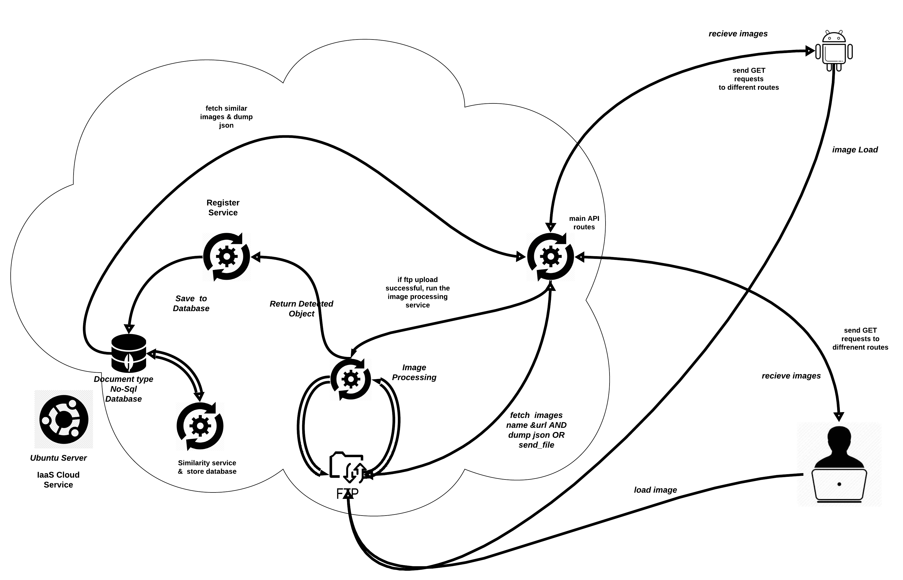

# image recommender system


 <div align="center">
  <h3>Image recommender system API using cosine similarity method</h3>
  
  
  <br>
  <a href="https://github.com/noaahhh/image-recommender-system/issues"></a>
  <a href="https://github.com/noaahhh/image-recommender-system/issues/stargazers"></a>
  <a href="https://github.com/noaahhh/image-recommender-system/issues/blob/main/LICENSE"></a>
</div>


<!-- ABOUT THE PROJECT -->
## About The Project

This project aims to design an API that recommend similar images  against  images names given as parameter. in the project, I used `flask`  as API framework and `MongoDB` as database on the Ubuntu Server. There are `vsftpd` as ftp server at the same location, db and API. Different python scripts  have different duty. You can check out project architecture image. For detection of image similarities, It's detected objects in an ımages using `imageAI` and `RESNET_50` model, then It's save MongoDB after formatting. When saving a new images on db, similarity script executes and maching similar images using cosine similarity method and saves mongoDB as a document. When a  request comes,  related images is find and its similar images are sent to client.  

<p align="right">(<a href="#top">back to top</a>)</p>


### Built With

* [ImageAI](https://imageai.org/)
* [Flask](https://flask.palletsprojects.com/)
* [MongoDb](https://mongodb.com/)
* [vsftpd](https://security.appspot.com/vsftpd.html)


<p align="right">(<a href="#top">back to top</a>)</p>


<!-- GETTING STARTED -->
## Getting Started

This is an example of how you may give instructions on setting up your project locally.
To get a local copy up and running follow these simple example steps.

### Prerequisites

*vsftpd
```sh
sudo apt install vsftpd
# or for Redhat based OS

sudo yum install vsftpd
```
*imageAI 
  ```sh
  pip3 install  imageAI
  ```
*flask
```sh
pip3 install -U flask
```
*mongoDB
```sh

$ sudo apt-key adv --keyserver hkp://keyserver.ubuntu.com:80 --recv 9DA31620334BD75D9DCB49F368818C72E52529D4

$ sudo add-apt-repository 'deb [arch=amd64] https://repo.mongodb.org/apt/ubuntu bionic/mongodb-org/4.0 multiverse'
$ sudo apt update 
$ sudo apt install mongodb-org
```
```sh
# OR for RHEL based os
$ sudo vi /etc/yum.repos.d/mongodb-org.repo
```
adding the following lines:
``` sh
[mongodb-org-3.4]
name=MongoDB Repository
baseurl=https://repo.mongodb.org/yum/redhat/$releasever/mongodb-org/3.4/x86_64/
gpgcheck=1
enabled=1
gpgkey=https://www.mongodb.org/static/pgp/server-3.4.asc
```
```sh
$ sudo yum install mongodb 
```
### Installation
after started MongoDB and ftp server, 
```sh 
python3 main.py 
```
if it is not done configuration mongoDB, ftp server and flask api, project cannot use.
 You  cannot use directly. This repo aims to be example project for the  developer want to code review. 

<p align="right">(<a href="#top">back to top</a>)</p>


<!-- USAGE EXAMPLES -->
## Usage

API usage is following line.

### Requests

| Route | HTTP Verb	 | Description	 |
| --- | --- | --- |
| /api/bitirme/images/all | `GET` |  Get all images . |
| /api/bitirme/images/get?img='foo.jpg' | `GET` |  Get similar images of given image. |
 /api/bitirme/images?name='bar.jpg' | `GET` | Get the image file. |
| /api/bitirme/saveImagesInfo?img='foo.jpg' | `GET` | Run object detection service . |


<p align="right">(<a href="#top">back to top</a>)</p>


<!-- LICENSE -->
## License

Distributed under the GPL-3 License. See `LICENSE` for more information.

<p align="right">(<a href="#top">back to top</a>)</p>


<!-- CONTACT -->
## Contact

@noaahhh - [@noah_the_turk](https://twitter.com/noah_the_turk) 

Project Link: [https://github.com/noaahhh/image-recommender-system](https://github.com/noaahhh/image-recommmeder-system)

<p align="right">(<a href="#top">back to top</a>)</p>


<!-- ACKNOWLEDGMENTS -->
## Acknowledgments

*  **Android client's video is loaded to the repo! You can check it out.**
* click the [document](doc-img/icerikOneriSistemi.pdf) (Turkish language) 

<p align="right">(<a href="#top">back to top</a>)</p>


